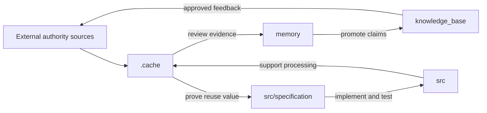
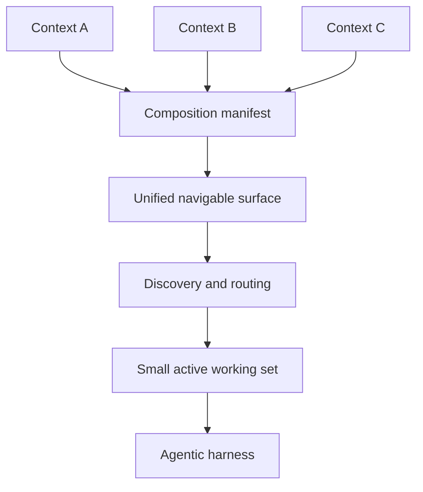
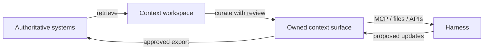

# Composable Context

## A Repository-Native Context Layer for Agentic Work

**Status:** Short whitepaper draft for comment  
**Date:** 2026-07-12  
**Scope:** Conceptual proposal; not a specification or validated architecture

## Abstract

Agentic systems can access growing collections of instructions, tools, files,
memories, indexes, and external services. Yet these capabilities are usually
assembled as unrelated integrations, while their ownership, maturity, and
provenance remain implicit. This paper proposes a **composable context**: a
conventionally structured, version-controlled repository that acts as an owned
and quality-gated unit of knowledge, skills, code, and investigation history.

A context maintains two promotion ladders. The knowledge ladder moves collected
material from a transient cache through reviewable episodic memory into curated
knowledge. The code ladder moves experiments from a scratch area into specified,
tested, reusable automation. Context repositories can then import one another
through a manifest and expose a unified navigable surface without erasing the
origin, namespace, version, or policy of each item.

The proposal is deliberately narrower than an agent framework, retrieval
engine, package manager, or new system of record. It defines the governed
surface from which an agentic harness may select context; the harness remains
responsible for loading only the small working set relevant to a task. The aim
is to make context portable, reviewable, composable, and safe enough to become
a shared engineering artifact.

## 1. The problem: access without lifecycle

Current agent stacks already expose project instructions, reusable skills,
tools, long-term memory, retrieval, and interoperability protocols. The missing
abstraction is often the lifecycle connecting them. A fetched document may
quietly become “memory”; a successful script may remain disposable; a plugin may
bundle tools without the knowledge needed to use them; and a large catalog may
be presented to a model without a clear ownership or trust boundary.

This is not solved by a larger context window. Context remains a finite attention
resource, and effective agents increasingly combine small preloaded instructions
with just-in-time exploration [1]. Tool-search and on-demand capability systems
similarly keep most definitions outside the active prompt until they are needed
[2, 3]. We therefore need to distinguish:

- the **available context surface** that an owner is prepared to expose; and
- the **active working context** that a harness selects for one task or turn.

Composable context addresses the first. It gives humans and agents a shared,
inspectable answer to: *What is available, where did it come from, who maintains
it, how mature is it, and under which rules may it be used?*

## 2. The context repository

A context is a repository with a small set of conventional lifecycle areas. A
minimal profile could look like this:

```text
.cache/                 fetched data, scratch code, provisional results
memory/                 bounded, source-backed investigation records
knowledge_base/         reviewed, reusable knowledge
src/specification/      durable behavior contracts
src/                    tested automation and reusable tooling
skills/                 optional agent-facing workflows and guidance
context.yaml            identity, imports, exports, versions, policies
```

The folder names are less important than their semantics. `.cache/` is local,
replaceable, and excluded from version control. `memory/` preserves episodic
work—questions, methods, evidence, uncertainty, and negative results—without
claiming that every observation is reusable truth. `knowledge_base/` contains
reviewed material whose claims remain traceable to investigations or stable
sources. Reusable code is governed by explicit specifications and ordinary
language package managers rather than by the context manifest.

The repository is the unit of ownership. Its maintainer decides what enters the
versioned surface, what is promoted, and what may be exported. A repository can
therefore bundle complementary knowledge, skills, scripts, and policies as a
higher-level capability that has already been deduplicated and reviewed by an
accountable owner.



**Figure 1 — Two promotion ladders.** Promotion is an explicit quality gate,
not an automatic consequence of extraction or generation.

This structure echoes research that treats raw traces, episodic memory,
procedural skills, and declarative rules as progressively compressed forms of
experience [4]. It also aligns with work that treats memory lifecycle,
versioning, access control, and traceability as first-class system concerns [5].
The distinctive claim here is practical: these concerns can share a lightweight,
Git-native governance boundary without requiring a new runtime or storage
standard.

## 3. Composition without prompt flooding

A context may import other contexts through a manifest. Importing is independent
of Python, JavaScript, or other package management: the manifest composes the
agent-facing context surface, while existing package managers continue to
resolve executable dependencies.

Composition produces a **logical union**, not an unqualified physical merge.
Every visible artifact retains its source context, path, revision, license,
provenance, and policy metadata. A unified tree, catalog, or search layer may
make the result feel flat to a user, but identities remain namespaced so that
collisions and updates are explainable.



**Figure 2 — Logical surface versus active context.** Composition determines
what may be discovered. The harness determines what enters the model context.

For fixed revisions and policies, composition should aim to be declarative and
root-order independent: composing A with B should expose the same identities as
composing B with A. This property is possible only if the system defines
deterministic version resolution, namespace handling, conflict reporting, and
policy intersection. Where two contexts cannot be reconciled safely, the
correct result is a visible composition error—not silent precedence.

Large compositions should not expose every tool schema and document body to the
model. A manifest compiler may prefilter entire contexts by declared scope, and
the harness may then apply task-level discovery, full-text or vector search,
graph queries, SQL, hierarchical routing, reranking, or direct file navigation.
Pydantic AI capabilities illustrate bundle-level on-demand loading [3], while
OpenAI tool search illustrates deferred tool-level loading [2]. These are useful
execution mechanisms, but they are not the governance model itself.

## 4. Boundaries and interoperability

Composable context is intended to cooperate with, rather than replace, existing
systems:

- **Not a source-of-truth replacement.** Requirements systems, wikis, ticketing
  tools, data platforms, and authoring environments remain authoritative. The
  context cache accelerates task work; memory and curated knowledge stage
  reviewable outcomes that may be fed back to those systems.
- **Not a retrieval standard.** Files, document elements, relational data,
  ontologies, vectors, graphs, and hierarchical summaries may coexist. The
  context preserves stable references and offers a navigable boundary over
  whichever retrieval substrates are appropriate.
- **Not a package manager.** The manifest selects and composes context
  repositories; `uv`, `npm`, and equivalent tools continue to manage executable
  dependencies and lockfiles.
- **Not an agent-to-agent protocol.** A2A enables agents owned by different
  parties and built on different frameworks to communicate [6]. Context
  composition instead lets one harness reason over a governed, shared surface.
  Both patterns can coexist.
- **Not a replacement for MCP.** MCP resources already provide standardized,
  URI-addressed discovery and reading of contextual data [7]. A composed context
  could be projected outward as MCP resources, prompts, or tools, with its
  provenance and policy metadata intact.



**Figure 3 — The knowledge feedback loop.** The repository governs agentic
work without automatically displacing the original authority.

## 5. Governance and security

Composition expands the supply-chain and execution boundary, so trust cannot be
implicit. A viable manifest should pin imported revisions, identify owners and
licenses, declare exported surfaces, preserve provenance, and support policy
constraints or signatures. Tool availability must be distinct from tool
authorization: an imported context may describe a tool, but the top-level
harness must still enforce the current user's credentials, sandbox, approvals,
and audit trail.

This single-harness model avoids one class of privilege ambiguity: a
lower-privileged agent does not receive results secretly obtained by a separate,
higher-privileged agent. It does not eliminate prompt injection, malicious
instructions, poisoned memory, vulnerable code, or dependency compromise.
Imported executable content therefore needs stronger review and isolation than
read-only knowledge.

Memory writes also require a conservative direction of control. The default
should not be silent extraction from conversations into durable memory. A safer
workflow is user-initiated and inspectable: *extract this lesson, write it to
this file, let me review it, then commit it*. Git history records change, but
human approval establishes intent.

## 6. Research questions and request for comments

The proposal is useful only if its claims can be tested. An initial prototype
and evaluation should address:

1. **Composition semantics:** Can imports remain deterministic, provenance-
   preserving, and understandable under version and namespace conflicts?
2. **Discovery quality:** Does repository-level bundling improve selection over
   a flat catalog of independently installed skills and tools?
3. **Context efficiency:** Can a large logical surface be navigated while
   keeping the active prompt small, stable, and relevant?
4. **Promotion quality:** Do explicit knowledge and code gates reduce stale,
   unsupported, or unsafe reuse without making contribution impractical?
5. **Authority round-tripping:** Can reviewed outcomes return to external
   systems without losing claim-to-evidence links or creating competing truths?
6. **Trust composition:** Which policies should intersect, inherit, or block
   composition, and how should users inspect the effective result?

Comments are especially invited on the minimal manifest, conflict semantics,
security model, measurable baselines, and whether the repository is the right
unit of ownership. A useful next step would be a small reference implementation
that composes two or three real repositories, exposes the result through a
harness-neutral catalog, and measures discovery accuracy, prompt cost, and
provenance retention.

## Selected references

Accessed 2026-07-12.

1. Anthropic, [Effective context engineering for AI agents](https://www.anthropic.com/engineering/effective-context-engineering-for-ai-agents).
2. OpenAI, [Using tools](https://developers.openai.com/api/docs/guides/tools).
3. Pydantic, [Capabilities — Pydantic AI](https://pydantic.dev/docs/ai/core-concepts/capabilities/).
4. Zhang et al., [Experience Compression Spectrum: Unifying Memory, Skills, and Rules in LLM Agents](https://arxiv.org/abs/2604.15877).
5. Li et al., [MemOS: An Operating System for Memory-Augmented Generation in Large Language Models](https://arxiv.org/abs/2505.22101).
6. A2A Project, [What is A2A?](https://a2a-protocol.org/latest/topics/what-is-a2a/).
7. Model Context Protocol, [Resources specification (2025-06-18)](https://modelcontextprotocol.io/specification/2025-06-18/server/resources).

## Draft provenance

This whitepaper synthesizes the local [idea and review note](readme.md),
[deep-research report](deep-research-report.md), and [reference record](context-composition-references.md).
It intentionally narrows the survey into a proposal suitable for an initial
request for comments. Claims about the proposed model are design hypotheses;
citations support adjacent ecosystem and research observations, not validation
of the model itself.
